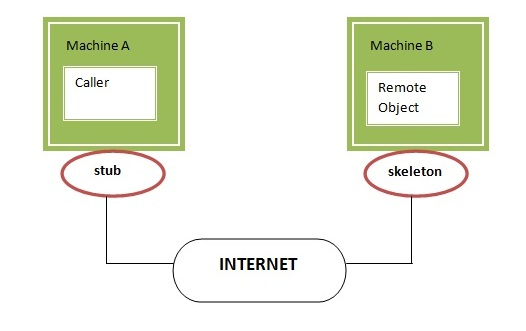

# Remote Graph Server

## Problem Statement
Write Java Server and Client programs that satisfy the following functionality. The server maintains a database of graphs and contains a function that returns the weight of the minimum spanning tree that the client interacts with using the following commands:
- `add_graph <graph_id>` : Adds a graph to the server
- `add_edge <graph_id> <u> <v> <w>` : Adds an edge to the graph
- `get_mst <graph_id>` : returns weight of minimum weight spanning tree

## Architecture
To accomplish this, we use Java's Remote Method Invocation to allow clients to call the above functions on the server. All aspects of the architecture are explained below. 



## Server side:
Note that the server contains the database as well as all the functions defined for the updation and retrieval of the data. 

### Interface and implementation
First, we write an interface, a template of all the methods that we want the client to be able to call. This server two purposes. Firstly, it aggregates together all the functions that the client can call - this file can be directly sent to the client as well. 

Secondly, when we _implement_ this interface, that is, write a class that actually contains the methods that were defined in the interface, we don't need to add any special access specifiers for the client accessible functions. For instance two methods can be declared public, but only the public methods that were defined in the interface will be available to the client. 
Check out the files `GraphInterface.java` and `GraphImplementation.java` for the interface and implementation. 

### The Server and Client
Now, at the IP where the server is running, we maintain a registry called the RMIRegistry a list and details of objects that are remotely available. When a client connects to this IP, it will be able to access the objects available in the registry. 

Therefore the server's job is just to create an object of the implementation and _bind_ it to the registry. 

The client then queries this registry and retrieves the object, which it traditionally calls a stub. The client can then call all the interface methods on this stub. 

### Algorithm Implementation
We use Prim's algorithm to compute the weight of the minimum weight spanning tree. The graph functions are available in `WeightedGraph.java`. Java's `PriorityQueue` functionality is used. 

## Results and Observations

To run this, ensure that files `GraphInterface.java` and `Client.java` are present on the client machine. And all of the files (except `Client.java`) should be present of the server machine. 

On the server, run:
- `javac *.java`
- `rmiregistry <port_no> &`
- `java Server <port_no>`

On the client, run:
- `javac *.java`
- `java Client <server_ip_address> <server_port_no> `

Here are some sample results for a 2-Client system:
(Here client 1 commands are run right after client 2 - In case they are interspersed, system will behave accordingly)

- Client 1 input
```
add_graph graph1 4
get_mst graph1
add_edge graph1 1 2 10
add_edge graph1 2 3 15
add_edge graph1 1 3 5
add_edge graph1 4 2 2
```

- Client 1 output
```
-1
```

- Client 2 input
```
add_edge graph1 4 3 40
add_graph lala 5
add_edge lala 1 4 3
add_edge lala 4 5 6
get_mst lala
```

- Client 2 output
```
-1 
17
```

We observe that the server maintains state across multiple clients. 